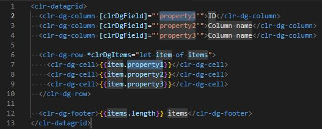
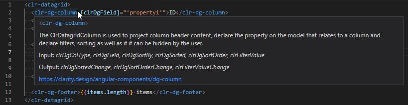

# Clarity language support - `clarity-vscode`

> Programmatic language features for Clarity Design System & Clarity Angular - https://clarity.design

## Features

- HTML template snippets.
- Hover information support for HTML template tags with input and output attributes.
- For both Clarity Design System & Clarity Angular.

### Snippets

[Clarity Design System components](https://clarity.design/core-components/) are prefixed with `cds-`.

[Clarity Angular components](https://clarity.design/angular-components/) are prefixed with `clr-`.

### Hover information

Hovers show information about the HTML element that's below the mouse cursor.
The hover contains a description about Clarity elements, the available input & output attributes, and an link to the official documentation.

## Development

1. Open the repository in VS Code.
2. Run `npm install` to install the dependencies.
3. Press <kbd>F5</kbd> to run the extension.
